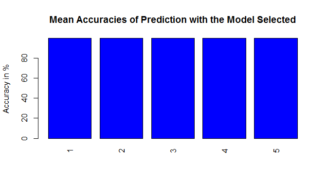

# Predictive Analysis on the quality of Exercise
###Author: Praveen Nair
##Executive Summary
Using devices such as Jawbone Up, Nike FuelBand, and Fitbit it is now possible to collect a large amount of data about personal activity relatively inexpensively. One thing that people regularly do is quantify how much of a particular activity they do, but they rarely quantify how well they do it.  
  
The goal of this project is to do the predictive analysis on the quality of the exercise and this is done using the data from accelerometers on the belt, forearm, arm, and dumbell of 6 participants. The participants were asked to to perform barbell lifts correctly and incorrectly in 5 different ways. More information about the data is available  [here](http://groupware.les.inf.puc-rio.br/har) - See the section on the Weight Lifting Exercise Dataset  
  
Based on the Analysis results the answers for the questions can be summarised as below.  

##Data Processing  
The training data for this project are available [here](https://d396qusza40orc.cloudfront.net/predmachlearn/pml-training.csv)  
  
The test data are available [here](https://d396qusza40orc.cloudfront.net/predmachlearn/pml-testing.csv)

Before loading the data, let us load the packages needed for this analysis.  

```r
library(ggplot2)
library(dplyr)
library(caret)
library(e1071)
library(rpart) 
library(rpart.plot)
library(randomForest)
```

###Loading the Data:  
The data for this project is available in the Datasets package and can be loaded using the following commands.  

```r
trainUrl <- "https://d396qusza40orc.cloudfront.net/predmachlearn/pml-training.csv"
testUrl <- "https://d396qusza40orc.cloudfront.net/predmachlearn/pml-testing.csv"

# Load the Data to Memory after converting "#DIV/0!", " " and "NA" values to NA
training <- read.csv(url(trainUrl), na.strings=c("NA","#DIV/0!",""))
testing <- read.csv(url(testUrl), na.strings=c("NA","#DIV/0!",""))

# Remove the columns which contains only NA values and the first 7 columns which contains user name, timestamps
# and window fields which won't affect the outcome 
modelset <- training[colnames(training[colSums(is.na(training)) == 0])[-(1:7)]]
```
  
##Prediction Modeling    
For the prediction model selection, three models are tested. The models used for this analysis are,  
* Decision Trees
* Generalized Boosted Regression and 
* Random Forests  
  
For the above three models, the cross validation and comparison startegy used is as given below.  
*Step 1:* Partition the cleaned up  modelset in the ratio  75:25 for training and validation. This is necessary to assess the performance of the prediction model and to make adjustments before using the model for predicting the outcomes with the test data.  
  
*Step 2:* Create the prediction model using Decision Trees / GBM / Random Forests   

*Step 3:* Split the training set in to 10 folds for crosss validation to check the prediction accuracy   
  
*Step 4:* Check the Accuracy of the model for each of the folds and see whether the prediction model is stable and acceptable (This is done for Random Forest Model only).  

The above steps can be found in the code snippet below.  

```r
# Setting the seed for reproducibility
set.seed(1234)

# Create the data partition using the ration 75:25
partition <- createDataPartition(y=modelset$classe, p=0.75, list=FALSE )

# Training set from the Modelset
ms_training <- modelset[partition,]

# Validation set from the Modelset
ms_testing <- modelset[-partition,]
```
  
Let us check the accuracy for Decision Tree Model

```r
# check the accuracy for decision tree model
model1 <- rpart(classe ~ ., data=ms_training, method="class")

# Record which guesses are correct
prediction1 <- predict(model1, newdata = ms_testing, type = "class")

# check the accuracy for decision trees
confusionMatrix(prediction1, ms_testing$classe)
```

```
## Confusion Matrix and Statistics
## 
##           Reference
## Prediction    A    B    C    D    E
##          A 1235  157   16   50   20
##          B   55  568   73   80  102
##          C   44  125  690  118  116
##          D   41   64   50  508   38
##          E   20   35   26   48  625
## 
## Overall Statistics
##                                           
##                Accuracy : 0.7394          
##                  95% CI : (0.7269, 0.7516)
##     No Information Rate : 0.2845          
##     P-Value [Acc > NIR] : < 2.2e-16       
##                                           
##                   Kappa : 0.6697          
##  Mcnemar's Test P-Value : < 2.2e-16       
## 
## Statistics by Class:
## 
##                      Class: A Class: B Class: C Class: D Class: E
## Sensitivity            0.8853   0.5985   0.8070   0.6318   0.6937
## Specificity            0.9307   0.9216   0.9005   0.9529   0.9678
## Pos Pred Value         0.8356   0.6469   0.6313   0.7247   0.8289
## Neg Pred Value         0.9533   0.9054   0.9567   0.9296   0.9335
## Prevalence             0.2845   0.1935   0.1743   0.1639   0.1837
## Detection Rate         0.2518   0.1158   0.1407   0.1036   0.1274
## Detection Prevalence   0.3014   0.1790   0.2229   0.1429   0.1538
## Balanced Accuracy      0.9080   0.7601   0.8537   0.7924   0.8307
```
  
Let us check the accuracy for Random Forest model now

```r
# check the accuracy for decision tree model
model2 <- randomForest(classe ~ ., data=ms_training, method="class")

# Record which guesses are correct
prediction2 <- predict(model2, newdata = ms_testing, type = "class")

# check the accuracy for decision trees
confusionMatrix(prediction2, ms_testing$classe)
```

```
## Confusion Matrix and Statistics
## 
##           Reference
## Prediction    A    B    C    D    E
##          A 1395    2    0    0    0
##          B    0  945    9    0    0
##          C    0    2  844    6    0
##          D    0    0    2  798    0
##          E    0    0    0    0  901
## 
## Overall Statistics
##                                           
##                Accuracy : 0.9957          
##                  95% CI : (0.9935, 0.9973)
##     No Information Rate : 0.2845          
##     P-Value [Acc > NIR] : < 2.2e-16       
##                                           
##                   Kappa : 0.9946          
##  Mcnemar's Test P-Value : NA              
## 
## Statistics by Class:
## 
##                      Class: A Class: B Class: C Class: D Class: E
## Sensitivity            1.0000   0.9958   0.9871   0.9925   1.0000
## Specificity            0.9994   0.9977   0.9980   0.9995   1.0000
## Pos Pred Value         0.9986   0.9906   0.9906   0.9975   1.0000
## Neg Pred Value         1.0000   0.9990   0.9973   0.9985   1.0000
## Prevalence             0.2845   0.1935   0.1743   0.1639   0.1837
## Detection Rate         0.2845   0.1927   0.1721   0.1627   0.1837
## Detection Prevalence   0.2849   0.1945   0.1737   0.1631   0.1837
## Balanced Accuracy      0.9997   0.9968   0.9926   0.9960   1.0000
```
  
**Based on the Accuracy and the 95% confidence interval comparison, it is evident that the Random Forest model predicts better than the Decision tree and hence we will use the Random tree model as the final model for our prediction**  
  
The next check to be done is to validate whether the model performs if the training data is changed.  
We will do the cross validation method to check the same.


```r
# Defining a numeric vector to hold the prediction accuracy for 5 iterations
accuracy_vector <- numeric(5)

for (iteration in 1:5) {
  
  # Create the data partition using the ration 75:25
  partition <- createDataPartition(y=modelset$classe, p=0.75, list=FALSE )
  
  # Training set from the Modelset
  ms_training <- modelset[partition,]
  
  # Validation set from the Modelset
  ms_testing <- modelset[-partition,]

  # Splits into 10 folds.
  folds <- createFolds(y = ms_training$classe, k = 10, list = FALSE)
  
  # create a logical vector which is the same size as that of ms_testing which is used for the validation
  # we'll set the value to True for all the correctly predicted values and will be used to check the accuracy
  validation_vector <- logical(nrow(ms_testing))
  for (ifold in 1:10) {
    
    # Split each folds in to training and validation sets for cross validation
    train_subset <- ms_training[folds != ifold, ]
    
    # The fold which has the same value as the counter is reserved for validation
    test_subset  <- ms_training[folds == ifold, ]

    # Step 3: Fit the model - Random Forests is executed below (Decision Trees and GBM code are commented) 
    # model <- rpart(classe ~ ., data=train_subset, method="class")
    # model <- train(classe ~ ., data = train_subset, method="gbm", verbose=FALSE)
    model <- randomForest(classe ~ ., data = train_subset, method="class")

    # Record which guesses are correct
    predictions <- predict(model, newdata = test_subset)
    
    # Set the value of the validation vector to TRUE if the predicted value is the same as the test classe
    validation_vector[folds == ifold] <- (predictions == test_subset$classe)
  }
  # Calculate the mean accuracy
  accuracy_vector[iteration] <- mean(validation_vector)
}
```
  
**A chart showing the prediction accuracy for the 5 iteration done above is shown below**


```r
barplot(height=data$Accuracy, 
        names.arg = data$Iteration, 
        main = "Mean Accuracies of Prediction with the Model Selected",
        ylab = "Accuracy in %", col = "blue", las = 3)
```


  
##Results   
Comparing the accuracy results of the cross validation for Decision Trees, GBM and Random Forests, it is evident that Random Forests model perform better compared to the other models and hence we chose the same model as our Final Model. The predicted classe for the test set can be found by executing the below code but the results are hidden as publishing the result might violate the Coursera code of conduct.  
  

```r
# Remove the columns which contains only NA values and the first 7 columns which contains user name, timestamps
# and window fields from the prediction set 
predictionset <- testing[colnames(testing[colSums(is.na(testing)) == 0])[-(1:7)]]

# Record which guesses are correct
prediction_Final <- predict(model2, newdata = predictionset, type = "class")
prediction_Final
```

